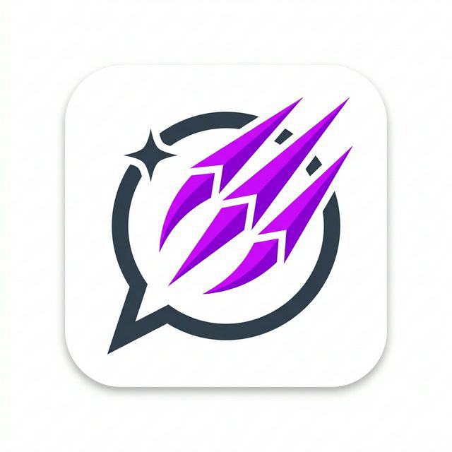

<div align="center">
  
</div>

# ClawWrite 🐾✍️

ClawWrite is a system-wide AI-powered writing assistant for Windows. It lets you rewrite, summarize, or enhance text in **any application**—Notepad, Chrome, Slack, Word, etc. Simply select your text, hit a global hotkey, and let Google Gemini AI do the rest.

## ✨ Features

- **System-Wide Integration**: Works seamlessly across any Windows application with text selection.
- **Fast & Fluid UI**: A floating, near-instant popup appears right near your cursor with a clean, premium light theme.
- **Persistent & Accessible**: The popup stays active and taskbar-visible so you can freely multitask, alt-tab, and return to your rewrites without losing state.
- **Auto-Replace**: Automatically replaces the originally selected text with the AI's output using simulated keystrokes.
- **Built-in Presets**: 8 quick actions including Improve, Make Formal, Make Casual, Shorten, Expand, Fix Grammar, Bullet Points, and Summarise.
- **Custom Instructions**: Type any freeform prompt to get exactly what you want out of the text.
- **Custom Presets**: Create, save, and manage your own reusable rewrite actions.
- **Rewrite History**: Keeps track of your previous 20 rewrites for easy reuse.
- **On-the-fly Recapture**: Need to change your selection while the popup is open? Select new text in the original app and hit the **↻ Recapture** button to load it instantly.

## 🚀 How It Works

1. **Select text** in any application.
2. Press `Ctrl + Shift + Space` (configurable).
3. The ClawWrite popup appears instantly.
4. Click a preset (e.g., "Make Formal") or type a custom instruction.
5. Watch the text transform.
6. Click **Replace** to auto-paste it back into your original app, or **Copy** to handle the text yourself.

## 🛠️ Prerequisites

- **OS**: Windows 10 or Windows 11 (Relies on Windows PowerShell and Win32 APIs for automation).
- **Node.js**: v18 or later (for development).
- **API Key**: A valid [Google Gemini API Key](https://aistudio.google.com/app/apikey).

## ⚙️ Installation & Setup

1. Clone the repository:
   ```bash
   git clone https://github.com/yourusername/clawwrite.git
   cd clawwrite
   ```
2. Install dependencies:
   ```bash
   npm install
   ```
3. Set up your environment variables:
   Create a `.env` file in the root directory and add your API key:
   ```env
   GEMINI_API_KEY=your_gemini_api_key_here
   ```
   *(Alternatively, you can set the API key directly via the visual Settings menu within the ClawWrite app).*
4. Run in development mode:
   ```bash
   npm run dev
   ```

## ⌨️ Global Hotkeys

| Action | Default Shortcut |
| :--- | :--- |
| **Summon ClawWrite** | `Ctrl + Shift + Space` |
| **Close / Back** | `Esc` (when in the popup) |

*You can configure the global hotkey string via the app's settings menu (accessible by right-clicking the system tray icon).*

## 🏗️ Architecture

ClawWrite runs on a powerful, modern stack designed for speed and security:
- **Frontend**: React 19 + TypeScript 5.4 with a custom-built, premium light theme.
- **Backend/Main**: Node.js powering the Electron 29 main process.
- **OS Automation**: Dynamic PowerShell scripts utilizing Win32 P/Invoke (`user32.dll`) for highly reliable text capture (simulated `Ctrl+C`) and auto-replacement (simulated `Ctrl+V`). Includes robust modifier key detection to ensure flawless macro execution.
- **AI Integration**: Powered by `@google/generative-ai` (`gemini-3-flash-preview`).

For an in-depth breakdown of the three-process IPC model and PowerShell integrations, see [ARCHITECTURE.md](ARCHITECTURE.md).

## 📦 Building for Production

Compile and package a Windows NSIS installer using `electron-builder`:

```bash
npm run dist
```
The installer executable will be generated in the output directory (typically `dist/`).

## 📄 License & Status

This project is built to demonstrate powerful desktop-level AI integrations on Windows. It is currently hardcoded to interface with Google's Gemini API and is not officially affiliated with Google.
